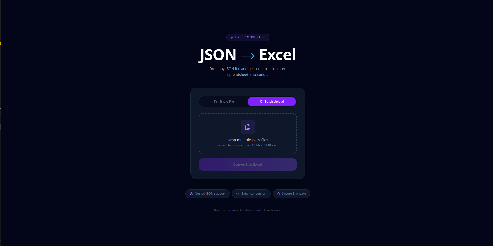
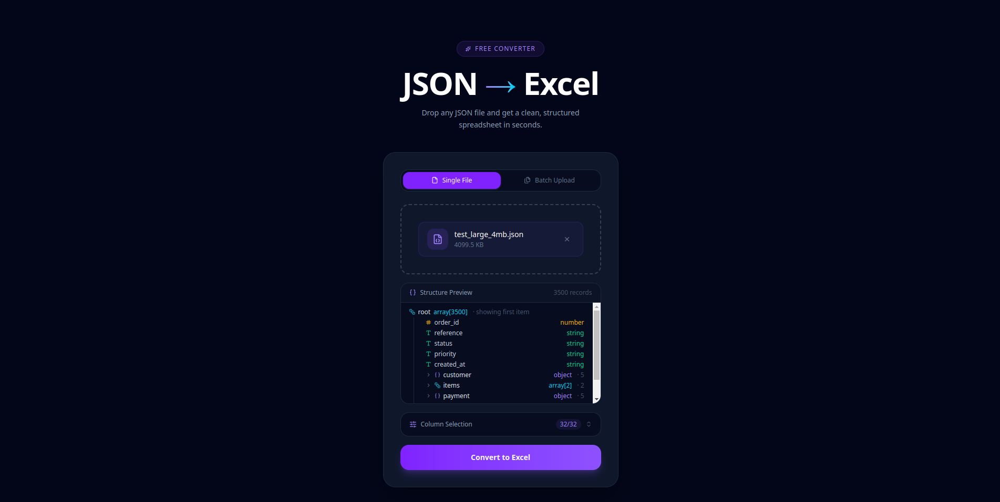
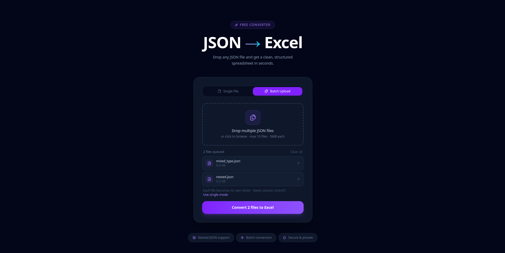
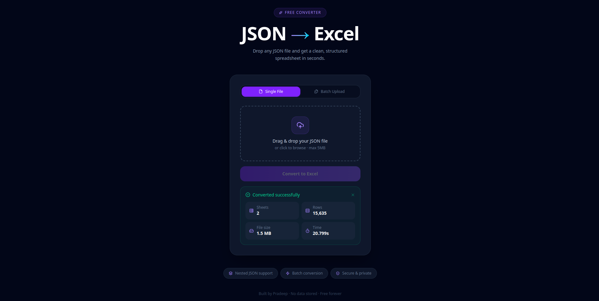
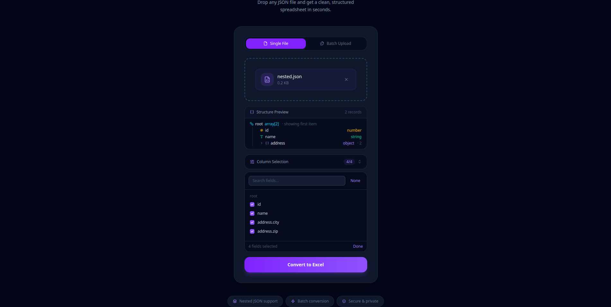
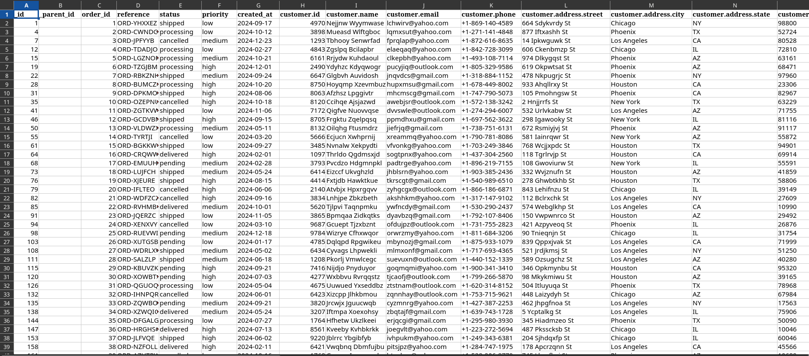
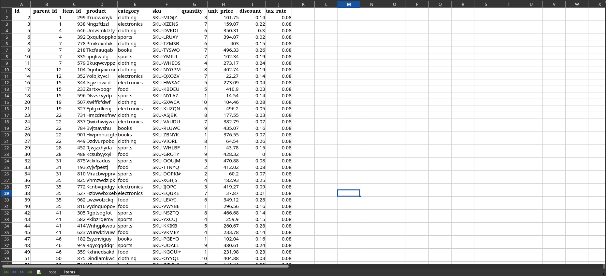

# JSON → Excel Converter

A high-performance web application that converts complex JSON files into structured Excel spreadsheets. The tool automatically flattens nested JSON, preserves relationships between objects, and generates multiple Excel sheets when required.

---

## 🌐 Live Demo

**Frontend**
https://json2excel-frontend.onrender.com

**Backend API (Swagger Docs)**
https://json2excel-app.onrender.com/docs

---

## 🚀 Features

- Convert JSON files to Excel instantly
- Handles deeply nested JSON structures
- Automatically generates multiple relational sheets
- Preserves hierarchy using `_id` and `_parent_id`
- Supports arrays, nested objects, and mixed JSON structures
- Streaming Excel generation for large files
- Automatic column sizing with bold headers
- Safe Excel sheet name handling
- Built-in JSON validation and error handling
- **JSON structure preview** before conversion
- **Conversion summary** — sheets, rows, file size, and time after every conversion
- **Upload progress bar** with real-time percentage
- **Drag & drop** with visual feedback
- **Column selection** — choose exactly which fields to include
- **Batch conversion** — upload multiple JSON files, get one combined Excel
- **API mode** — send raw JSON directly, no file upload needed

---

## 🖼 Screenshots

### Upload & Preview



### Json Preview



### Batch Upload



### Conversion Summary



### Column selection



### Excel Output





---

## 🧠 How It Works

The converter analyzes the JSON hierarchy and maps it into relational Excel sheets.

**Example input:**

```json
{
  "order_id": 101,
  "customer": {
    "name": "Pradeep"
  },
  "items": [
    { "product": "Laptop", "price": 70000 },
    { "product": "Mouse", "price": 1000 }
  ]
}
```

**Generated Excel structure:**

Sheet: `root`

| \_id | \_parent_id | order_id | customer.name |
| ---- | ----------- | -------- | ------------- |
| 1    |             | 101      | Pradeep       |

Sheet: `items`

| \_id | \_parent_id | product | price |
| ---- | ----------- | ------- | ----- |
| 2    | 1           | Laptop  | 70000 |
| 3    | 1           | Mouse   | 1000  |

This structure preserves the original JSON relationships inside Excel.

---

## 🏗 Architecture

```
React + Vite + Tailwind v4
        ↓
     FastAPI API
        ↓
    JSON Parser
        ↓
   OpenPyXL Engine
        ↓
  Excel File Download
```

---

## 🛠 Tech Stack

**Frontend:** React, Vite, TailwindCSS v4, TypeScript

**Backend:** Python, FastAPI, OpenPyXL, Uvicorn

**Deployment:** Render (Frontend + Backend)

---

## 📂 Project Structure

```
json2excel
│
├── backend
│   ├── main.py
│   ├── converter.py
│   └── requirements.txt
│
├── frontend
│   ├── src
│   ├── package.json
│   └── vite.config.ts
│
└── README.md
```

---

## ⚙️ Local Setup

**1. Clone the repository**

```bash
git clone https://github.com/pradeepr-usr/json2excel.git
cd json2excel
```

**2. Backend**

```bash
python -m venv env
source env/bin/activate
pip install -r backend/requirements.txt
uvicorn backend.main:app --reload
```

Runs at `http://127.0.0.1:8000`

**3. Frontend**

```bash
cd frontend
npm install
npm run dev
```

Runs at `http://localhost:5173`

---

## 📡 API

### File Upload

`POST /convert/` — Upload a JSON file and receive an Excel file.

```bash
curl -X POST \
  -F "file=@example.json" \
  http://127.0.0.1:8000/convert/ \
  --output output.xlsx
```

With field filtering:

```bash
curl -X POST \
  -F "file=@example.json" \
  -F "fields=id,name,price" \
  http://127.0.0.1:8000/convert/ \
  --output output.xlsx
```

### Batch Upload

`POST /batch-convert/` — Convert multiple JSON files into one Excel workbook. Each file becomes its own sheet.

```bash
curl -X POST \
  -F "files=@orders.json" \
  -F "files=@users.json" \
  -F "files=@products.json" \
  http://127.0.0.1:8000/batch-convert/ \
  --output batch.xlsx
```

### API Mode

`POST /convert-json/` — Send raw JSON directly in the request body. No file upload needed. Ideal for scripts, ETL pipelines, and automation.

```bash
curl -X POST http://127.0.0.1:8000/convert-json/ \
  -H "Content-Type: application/json" \
  -d '[{"id": 1, "name": "Alice"}, {"id": 2, "name": "Bob"}]' \
  --output result.xlsx
```

With field filtering and custom filename:

```bash
curl -X POST "http://127.0.0.1:8000/convert-json/?fields=id,name&filename=users" \
  -H "Content-Type: application/json" \
  -d '[{"id": 1, "name": "Alice", "secret": "hidden"}]' \
  --output users.xlsx
```

### Response Headers

All endpoints return conversion metadata in response headers:

| Header               | Description                                        |
| -------------------- | -------------------------------------------------- |
| `X-Summary-Sheets`   | Number of sheets generated                         |
| `X-Summary-Rows`     | Total rows written                                 |
| `X-Summary-Size-KB`  | Output file size in KB                             |
| `X-Summary-Time-Sec` | Processing time in seconds                         |
| `X-Summary-Files`    | Number of files processed (batch only)             |
| `X-Summary-Errors`   | Number of files skipped due to errors (batch only) |

---

## 🛡 Safety Features

- JSON format validation
- File size protection (max 5MB per file)
- Batch size protection (max 10 files, 20MB total)
- Row explosion protection (max 50k objects)
- Safe Excel sheet naming
- Memory-efficient Excel generation

---

## 📊 Performance

| JSON Size         | Time   |
| ----------------- | ------ |
| Small (<100 rows) | <0.05s |
| Medium (~1k rows) | ~0.2s  |
| Large (~10k rows) | <1s    |

---

## 🔮 Roadmap

- [x] JSON structure preview before conversion
- [x] Conversion summary (sheets, rows, size, time)
- [x] Upload progress indicator
- [x] Dark mode interface
- [x] Column selection UI
- [x] Batch file conversion
- [x] API mode (send JSON directly, no file upload)
- [ ] Authentication and usage limits
- [ ] Paid plans via Stripe

---

## 👨‍💻 Author

**Pradeep** — Software Developer
